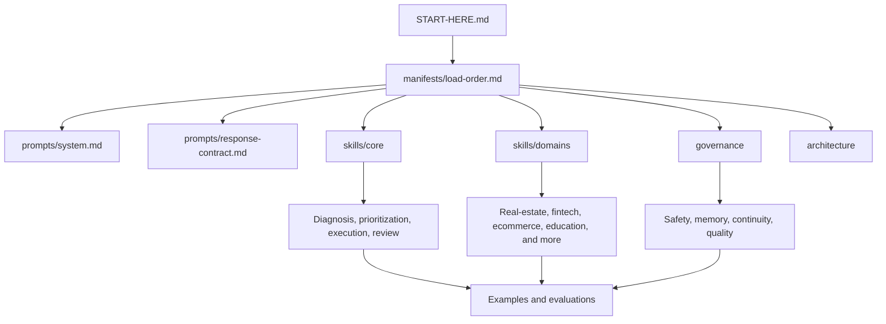

# Egypt Mentor Agent

[**English**](README.md) | [**العربية**](README.ar.md)

**حزمة مفتوحة المصدر من البرومبتات والمهارات وأدوات التقييم لبناء وكيل ذكاء اصطناعي بنمط mentor موجه للمستخدم المصري.**

*مشروع منضبط للمطورين الذين يريدون تشخيصًا أفضل، وأولوية أوضح، ومتابعة أصدق من أي advice bot عام.*

---

## :dart: لماذا هذا المشروع؟

أغلب أنظمة "الكوتشينج" بالذكاء الاصطناعي تفشل بنفس الطريقة:

- تعطي نصيحة قبل فهم الحالة
- تسأل أسئلة عامة ومتكررة
- تفتح مسارات كثيرة في وقت واحد
- تخلط بين الحماس والاستراتيجية
- تنتج خططًا تبدو جيدة على الورق لكنها تنهار في الحياة الواقعية

`egypt-mentor-agent` بُني ليعمل بعكس هذا الاتجاه.

فكرته الأساسية أن يساعد أي نظام ذكاء اصطناعي على الإجابة عن أسئلة مثل:

- ما الذي يجب أن يركز عليه هذا المستخدم الآن؟
- ما هو الاختناق الحقيقي؟
- ما الخطوة التالية المناسبة لظروفه من وقت ومال ومسؤوليات؟
- كيف يجب أن يتعامل الوكيل مع عودة المستخدم بعد تنفيذ ضعيف أو تغيّر في الواقع؟

المشروع موجه إلى مصر أولًا، لكنه منظم بحيث يمكن إعادة استخدام "عقل mentoring" نفسه داخل أكثر من host أو منتج.

## :sparkles: ما الذي يميّزه؟

| Advice bot تقليدي | Egypt Mentor Agent |
| --- | --- |
| يعطي نصيحة قبل فهم الحالة | يبني case map قبل أي خطة جدية |
| يفتح مسارات كثيرة | يفترض أولوية رئيسية واحدة افتراضيًا |
| يعتمد على كلام تحفيزي عام | يعتمد على الأدلة والاختناقات والقيود |
| يعامل التخطيط كأنه إنجاز | يعتبر التنفيذ الموثق هو الإنجاز |
| يعيد بدء الحوار من الصفر كل مرة | يحافظ على الاستمرارية إذا كان الـ host يدعم الذاكرة |
| يبدو مفيدًا لكنه يبقى vague | يخرج خطوات قابلة للمراجعة والمتابعة |

## :brain: ما هو هذا الريبو؟

هذا المستودع عبارة عن **prompt pack مستقل عن أي منصة** لبناء وكيل طويل المدى بنمط mentor.

يمكن إعادة استخدامه داخل:

- أدوات المحادثة التي تدعم الملفات
- وكلاء داخل المحررات
- بيئات شبيهة بـ custom GPTs
- wrappers محلية للذكاء الاصطناعي
- أي تكاملات مستقبلية أخرى

وهو يتضمن حاليًا:

- ملف bootstrap للدخول
- system prompt رئيسي
- response contract للجودة
- مهارات أساسية modular
- مهارات قطاعية modular
- حوكمة وضوابط طويلة المدى
- أمثلة واقعية
- rubrics وتقييمات وdry runs
- مراجع معمارية للمطورين

## :card_file_box: خريطة المستودع

| المسار | الوظيفة |
| --- | --- |
| `START-HERE.md` | نقطة الدخول الأساسية للـ hosts التي تدعم تحميل الملفات أو منشن الملفات |
| `prompts/system.md` | قواعد السلوك الأساسي للوكيل |
| `prompts/response-contract.md` | عقد الجودة الداخلي للردود القوية |
| `skills/core/` | مهارات أساسية قابلة لإعادة الاستخدام عبر كل المجالات |
| `skills/domains/` | عدسات قطاعية مصرية مثل العقارات والفنتك والإيكومرس وغيرها |
| `governance/` | السلامة والذاكرة والمراجعة وضبط الجودة طويل المدى |
| `manifests/` | ترتيب التحميل ووصف قدرات الـ host |
| `examples/` | حالات واقعية توضح السلوك المقصود |
| `evaluations/` | checklists وscoring rubrics وdry runs |
| `architecture/` | مراجع بنيوية للمطورين |
| `CONTRIBUTING.md` | قواعد المساهمة وتوسيع المشروع بدون كسر فلسفته |

## :arrows_counterclockwise: كيف يعمل؟

## :rocket: البدء السريع

### إذا كان الـ host يدعم file mentions أو file loading

1. ابدأ من `START-HERE.md`
2. اتبع `manifests/load-order.md`
3. حمّل فقط ملفات الـ domain المناسبة للحالة الحالية

### إذا كان الـ host لا يدعم file mentions

1. حمّل `START-HERE.md` يدويًا داخل الـ context
2. ثم اتبع `manifests/load-order.md`
3. حافظ على نفس البنية ونفس قواعد السلوك

### إذا أردت تقييم المشروع بسرعة

1. اقرأ `examples/founder-no-revenue.md`
2. اقرأ `evaluations/dry-runs/founder-no-revenue-dry-run.md`
3. راجع `evaluations/checklist.md`
4. راجع `evaluations/scoring-rubric.md`

## :compass: المبادئ التصميمية الأساسية

- مصر هي العدسة الافتراضية
- التشخيص يسبق التخطيط
- أولوية رئيسية واحدة افتراضيًا
- خطط مرحلية بدل roadmaps ضخمة
- دليل التنفيذ أهم من نية التنفيذ
- المتابعة يجب أن تتفاعل مع الواقع لا مع الأمنيات
- التفكير القطاعي يجب أن يكون actor-aware
- الحزمة يجب أن تبقى مستقلة عن الـ host

## :package: التغطية الحالية

### القدرات الأساسية

| المجال | التغطية |
| --- | --- |
| التشخيص | intake وguided questioning وcase mapping |
| جودة القرار | validation وmonetization وprioritization |
| التنفيذ | planning وfocus وreview وreplanning |
| الطبقة الإنسانية | behavior وfriction وavoidance وcontinuity |
| الحوكمة | safety وmemory وreview loops وupdate policy |

### العدسات القطاعية

| القطاع | العدسة الأساسية |
| --- | --- |
| العقارات | وضوح الأطراف وقيمة workflow ومسار monetization |
| الفنتك | الثقة واحتكاك الالتزام والتنظيم وقيمة workflow المالي |
| الإيكومرس | التحويل والتنفيذ والهوامش والشراء المتكرر |
| التعليم | الفرق بين learner وbuyer والحضور والنتائج والربحية |
| العمل والمسار المهني | قابلية التوظيف وإثبات القدرة واختيار مسار واقعي |
| الـ creator والميديا | الفرق بين الانتباه والثقة والقيمة القابلة للتحويل إلى دخل |
| الخدمات المحلية | مسار inquiry-to-booking والجودة والإحالات والتكرار |
| الرعاية الصحية | فصل safety-first بين التشغيل وبين الحكم الطبي |
| التقنية | اختيار lane مناسب ودخول عملي مناسب للسوق المصري |

## :test_tube: معيار الجودة

أي تطبيق قوي لهذه الحزمة يجب أن ينتج ردودًا:

- تقلل الحيرة
- تحدد الاختناق الحقيقي
- تناسب قيود المستخدم الواقعية
- تمنع تشتيت المجهود على مسارات كثيرة
- تخلق خطوة تالية قابلة للمراجعة
- تصبح أذكى مع الوقت عبر الاستمرارية والأدلة

المشروع يحتوي بالفعل على:

- أمثلة واقعية داخل `examples/`
- أصول تقييم داخل `evaluations/`
- dry run كامل داخل `evaluations/dry-runs/`

## :no_entry_sign: ما الذي لا يتضمنه المشروع؟

هذا المستودع لا يوفّر حاليًا:

- runtime جاهزًا
- واجهة استخدام
- قاعدة بيانات أو persistence layer
- memory backend
- API مستضافة
- تكاملًا خاصًا بمزوّد واحد

وهذا مقصود.
الهدف أن يظل "عقل mentoring" نفسه قابلًا لإعادة الاستخدام في بيئات كثيرة.

## :hammer_and_wrench: للمطورين

### إذا كنت تريد دمج المشروع داخل منتج

ابدأ من:

- `START-HERE.md`
- `manifests/load-order.md`
- `prompts/system.md`
- `prompts/response-contract.md`
- `architecture/agent-spec.md`

### إذا كنت تريد تطوير المشروع نفسه

ابدأ من:

- `CONTRIBUTING.md`
- `examples/README.md`
- `evaluations/README.md`

## :handshake: المساهمة

المساهمات مرحب بها، لكن المشروع يجب أن يظل منضبطًا.

قبل أي تغيير في السلوك، اقرأ:

- `CONTRIBUTING.md`

وفي أي تغيير مهم، يفضّل تحديث واحد على الأقل من:

- مثال
- أصل تقييم

حتى يبقى المشروع مبنيًا على السلوك الواقعي لا على التنظير فقط.

## :page_facing_up: الترخيص

MIT License.  
راجع `LICENSE`.
