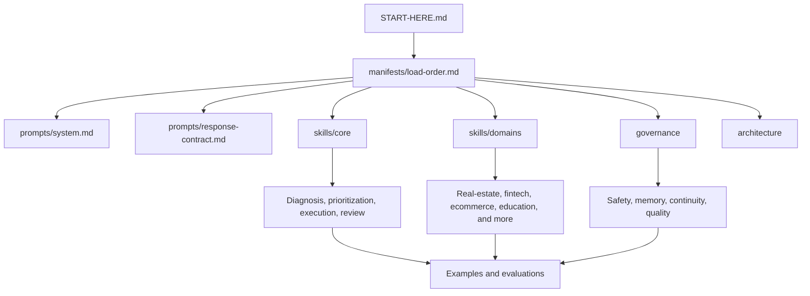

# Egypt Mentor Agent

[**English**](README.md) | [**Arabic**](README.ar.md)

**Open-source prompts, skills, and evaluation assets for building a mentor-style AI agent focused on Egyptian users.**

*A disciplined prompt pack for builders who want better diagnosis, tighter prioritization, and more honest follow-up than a generic advice bot can provide.*

---

## :dart: Why This Exists

Most AI "coach" systems fail in the same way:

- they jump into advice too early
- they ask broad, repetitive questions
- they open too many paths at once
- they confuse motivation with strategy
- they generate plans that sound good but collapse in real life

`egypt-mentor-agent` is built to do the opposite.

It is designed to help an AI system answer questions like:

- What should this user focus on now?
- What is the actual bottleneck?
- What should happen next given time, money, and life constraints?
- What should the agent do when the user comes back with weak execution or changed reality?

The project is Egypt-first by default, but structured so the mentoring brain can be reused across different hosts and products.

## :sparkles: What Makes It Different

| Typical AI advice bot | Egypt Mentor Agent |
| --- | --- |
| Gives advice before understanding the case | Builds a case map before serious planning |
| Offers many paths at once | Defaults to one real priority |
| Uses generic motivation language | Uses evidence, bottlenecks, and constraints |
| Treats planning as success | Treats execution evidence as success |
| Restarts the conversation every time | Preserves continuity when the host supports memory |
| Sounds helpful but stays vague | Produces reviewable next steps |

## :brain: What This Repo Is

This repository is a **host-agnostic prompt pack** for a long-term mentor-style agent.

It is meant to be reused across:

- file-aware chat tools
- editor agents
- custom GPT-style environments
- local AI wrappers
- future runtime integrations

It currently includes:

- a bootstrap entrypoint
- a system prompt
- a response contract
- modular core skills
- modular domain skills
- governance guardrails
- realistic examples
- evaluation rubrics and dry runs
- builder-facing architecture notes

## :card_file_box: Repository Map

| Path | Purpose |
| --- | --- |
| `START-HERE.md` | Bootstrap entrypoint for hosts that support file loading or mentions |
| `prompts/system.md` | Core mentoring behavior and operating rules |
| `prompts/response-contract.md` | Internal quality contract for strong responses |
| `skills/core/` | Reusable cross-domain decision and execution skills |
| `skills/domains/` | Egypt-aware domain lenses such as real estate, fintech, ecommerce, and more |
| `governance/` | Safety, memory, review, and long-term quality controls |
| `manifests/` | Load order and host capability references |
| `examples/` | Realistic worked cases that show intended behavior |
| `evaluations/` | Checklists, scoring rubrics, and dry runs |
| `architecture/` | Builder-facing structural references |
| `CONTRIBUTING.md` | Rules for extending the repo without breaking its philosophy |

## :arrows_counterclockwise: How It Works

## :rocket: Quick Start

### If your host supports file mentions or file loading

1. Start from `START-HERE.md`
2. Follow `manifests/load-order.md`
3. Load only the domain files relevant to the current case

### If your host does not support file mentions

1. Manually load `START-HERE.md` into the host context
2. Then follow `manifests/load-order.md`
3. Preserve the same structure and behavior rules

### If you want to evaluate the system quickly

1. Read `examples/founder-no-revenue.md`
2. Read `evaluations/dry-runs/founder-no-revenue-dry-run.md`
3. Review `evaluations/checklist.md`
4. Review `evaluations/scoring-rubric.md`

## :compass: Core Design Principles

- Egypt-first by default
- diagnosis before planning
- one main priority by default
- current-phase plans over giant roadmaps
- execution evidence over intention
- follow-up that reacts to reality, not wishful thinking
- actor-aware domain reasoning
- host-agnostic packaging

## :package: Current Coverage

### Core capabilities

| Area | Coverage |
| --- | --- |
| Diagnosis | intake, guided questioning, case mapping |
| Decision quality | validation, monetization, prioritization |
| Execution | planning, focus, review, replanning |
| Human layer | behavior, friction, avoidance, continuity |
| Governance | safety, memory, review loops, update policy |

### Domain lenses

| Domain | Primary lens |
| --- | --- |
| Real estate | actor clarity, workflow value, monetization path |
| Fintech | trust, compliance friction, financial workflow value |
| Ecommerce | conversion, fulfillment, margin, repeat behavior |
| Education | learner vs buyer, attendance, outcomes, monetization |
| Career & work | employability, proof of capability, realistic path selection |
| Creator & media | attention vs trust vs monetizable value |
| Local services | inquiry-to-booking flow, quality, referrals, repeat |
| Healthcare | safety-first separation between operations and medical judgment |
| Tech | lane selection and Egypt-fit entry paths |

## :test_tube: Quality Standard

A strong implementation of this repo should consistently produce responses that:

- reduce confusion
- identify the real bottleneck
- fit the user's actual constraints
- avoid spreading effort across many tracks
- create a reviewable next step
- become smarter over time through continuity and evidence

This repo already includes:

- realistic examples in `examples/`
- scoring assets in `evaluations/`
- a worked dry run in `evaluations/dry-runs/`

## :no_entry_sign: What This Repo Does Not Include

This repository does **not** currently ship with:

- a bundled runtime
- a UI
- a database or persistence layer
- a memory backend
- a hosted API
- a provider-specific integration

That is intentional.
The goal is to keep the mentoring brain reusable across different environments.

## :hammer_and_wrench: For Builders

### Integrating the repo into a product

Start here:

- `START-HERE.md`
- `manifests/load-order.md`
- `prompts/system.md`
- `prompts/response-contract.md`
- `architecture/agent-spec.md`

### Extending the repo itself

Start here:

- `CONTRIBUTING.md`
- `examples/README.md`
- `evaluations/README.md`

## :handshake: Contributing

Contributions are welcome, but this project should stay disciplined.

Before changing behavior, read:

- `CONTRIBUTING.md`

For meaningful changes, prefer updating at least one of:

- an example
- an evaluation artifact

That keeps the project grounded in real behavior instead of theory alone.

## :page_facing_up: License

MIT License.
See `LICENSE`.

